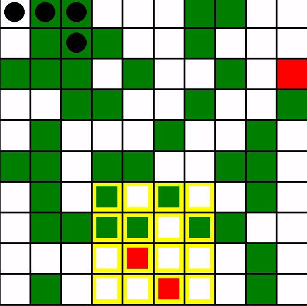

# FireDronesRL

<figure align='center'>

<figcaption>Pygame visualization of one training episode</figcaption>
</figure>

FireDronesRL is a multi-agent reinforcement learning (MARL) project where multiple agents (drones) are trained to manage wildfire in a 2D grid forest. Drones have local view of grid and collaborate to extinguish the fire quickly.

### Motivation and Application

This project can be used as an example MARL project for beginners Ray RLlib, a Python Reinforcement Learning library undergoing active development and improvements. Many existing tutorials online does not accurately reflect the latest version of the library and often includes deprecated code that would cause error; e.g. many tutorials don't use the new `ray.rllib.algorithms`.

> **Note**
> This project used Ray 2.6.1 and Gymnasium 0.26.3. Using other versions (especially Ray) may cause error.

Furthermore, the concept of colaborative agents with local vision chasing (potentially) dynamic targets can be applied to other related problems, such as capturing wild animals or agents in video games.

## Problem Description

**Environment Setup**: A 2D integer grid. At the beginning of each episode, the following arrangements are made:

1. A tree is planted in each cell with probability `prob_tree_plant`.
2. `num_fires` unique trees are set on fire.
3. `num_agents` agents are placed at cell (0,0).

Inside the grid, 0 represents an empty cell, 1 a tree cell, and 2 a fire cell. The presence of one drone increments the state by 3. For example, 11 represents a cell on fire with 3 drones in it. Hence the base of the cell can be found by `cell_state % 3`.

**Agents**: Drones that move around the grid and extinguish fire by spraying water. Their goal is to extinguish all fire fast. Each agent's action space is [Discrete(9)](https://gymnasium.farama.org/api/spaces/fundamental/#discrete), and their description is as follows:

-   0-3, 5-8: Move into another cell in the grid. 0=NW, 1=N (up), 2=NE, 3=W (left), 5=E (right), 6=SW, 7=S (down), 8=SE. Agents cannot move outside of the grid. e.g. Attempting to move up-right from a cell that's next to top border will just move the agent to its right.
-   4: Spray water. When action 4 is taken in a fire cell, the fire will be extinguished.
-   Note: Drones can enter fire cells (they should in order to put off fire) and multiple drones may be present at the same cell.

**State**: Observation at time $t$. Each agent gets one observation per timestep. Observation space is [MultiDiscrete(...)](https://gymnasium.farama.org/api/spaces/fundamental/#multidiscrete) and contains information of (1) the agent's current coordinate on grid, and (2) its surrounding cells' state. The number of surrounding cells is determined by `agents_vision` parameter. `agents_vision=1` makes the 3x3 grid (with the agent in the center) visible, and `agents_vision=2` makes the 5x5 grid visible, and so on. An observation where the vision level is one therefore has length 11 (row-coordinate + column-coordinate + 9 visible cells' states).

Note: All agent shares the same level of vision.

This state definition divides the state into two parts, in terms of the transition probabilities $P(s'|s,a)$ for each state-action pair $(s,a)$. The coordinates are deterministic and dependent on agent's action. The surroundings are stochastic and independent of agent's action, as fire spreads independently of agent's action (other than extinguishing fire, of course).

Such separation eases the problem of learning policies when state transitions are both stochastic and dependent on agent's actions. However, as that is one of the major challenges in RL, we may want to update the project so that it can generalize better. One possible revision is to make the `prob_fire_spread`s dependent on agent's action, e.g., moving to a certain direction lowers or raises `prob_fire_spread`, presence of a drone changes `prob_fire_spread`, etc.

**Reward**: +1 for extinguishing one fire, and -1 at each timestep (time penalty).

**Updates at Each Timestep**

1. Agents take one of the nine actions (0-8).
2. Agents' rewards are updated based on 1.
3. Fire spreads with some probability:

    - A sub-area at the bottom center of the grid has higher probability of fire spread: `prob_fire_spread_high`.
    - All other cells has `prob_fire_spread_low`.
    - Fire can only spread to tree cells, not an empty cell or another fire cells.
    - Fire may spread to multiple neighboring cells in one timestep.
    - Agents are expected to tackle the high-fire-spread area first as the learning progresses.

> **Note**
> Many of the environment parameters are configurable. Please see `env_config` object in `trainer.py` to see all adjustable configuration parameters.

## Requirements

This project uses the following libraries:

-   [Ray RLlib (2.6.1)](https://docs.ray.io/en/latest/rllib/index.html)
-   [Gymnasium (0.26.3)](https://gymnasium.farama.org/)

To see how to install Anaconda, see [here](https://docs.anaconda.com/free/anaconda/install/).

### Install requirements from scratch

```
# This is how fd_train_env.yml is made
conda create -n fd_train
conda activate fd_train
conda install -c conda-forge "ray-rllib"
```

Ray may ask you to update some packages' versions or download additional packages (shouldn't be that many).

Let's set up a separate conda environment to visualizie training process with Tensorboard:

```
# This is how tensorboard_env.yml is made
conda create -n tb-rllib
conda activate tb-rllib
pip install ray[rllib]
conda install chardet markdown requests tensorboard protobuf=3.20.3
```

A new conda environment is used because packages needed to run Tensorboard causes conflicts with packages used to run `trainer.py`.

### Install requirements using .yml files

1. Download .yml files in `conda_envs` folder
2. `conda env create --name your-env-name --file=<put_filename_here>.yml`

Use `fd_train_env` to run `trainer.py` and `tensorboard_env` to view your train results with `tensorboard --logdir .`.

## How to Run

All training code is in `trainer.py`. Simply activate the appropreate conda environment and run `python3 trainer.py`. Play around with different environment/algorithm configuration/algorithm choice and the number of calls to `algo.train()`.

Should you load saved model, use `load_trained_model.py`.

FYI, training more than 100 rounds may take 30+ min.

### Files

-   `environment.py`: Defines the FireDrones environment. All the details--reward function, state update, agent interactions, etc. are defined in class FireDrones.
-   `callback.py`: Defines custom metrics to measure performance of agents.
-   `trainer.py`: Where learning happens.
-   `load_trained_model.py`: If you want to load trained model for further use.

## How to View Results

After running `trainer.py`, follow the steps below:

1. Go to ~/ray*results/PPO/PPO_MultiAgentArena*[some key]00000*0[date]*[time]/
2. In that directory, you should see a event.out.... file.
3. Run `tensorboard --logdir .` and head to https://localhost:6006 in your browser.

## Extending the Project

Here are some additional considerations that can be incoorporated to create more realistic dynamics:

-   Total amount of water each drone can spray is less than or equal to its water capacity
-   Drones must replenish its battery and water
-   Ensure safety distance between fire and drones
-   Add environmental factors (e.g. wind affects fire spread direction)
-   Extendable map with custom grid size
-   etc.

## Useful Tutorials

-   [MultiAgentEnv implementation](https://docs.ray.io/en/latest/_modules/ray/rllib/env/multi_agent_env.html#main-content): The comments are very descriptive and helpful

-   [Example codes found online](./examples/)

-   [Ray Summit 2021 tutorial: a bit outdated but explains MultiAgentEnv well](https://github.com/sven1977/rllib_tutorials/blob/main/ray_summit_2021/tutorial_notebook.ipynb)
